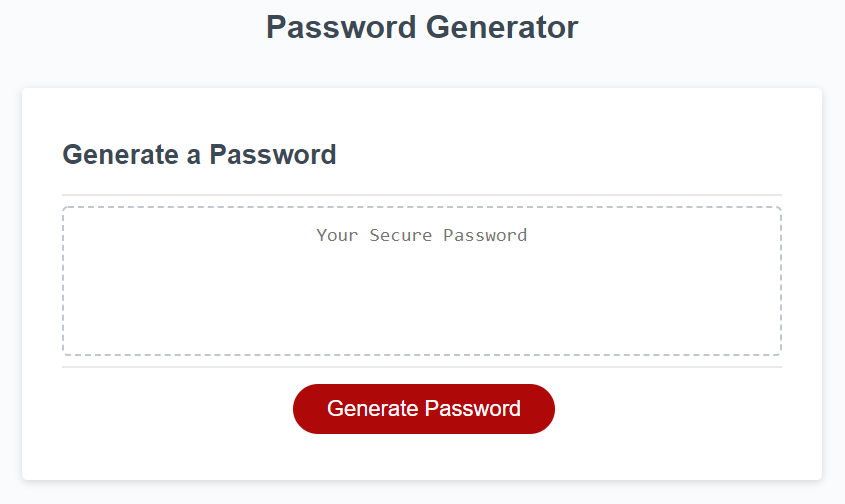

# 03 JavaScript: Password Generator

Create an application that generates a random password based on user-selected criteria. The app runs in the browser and features dynamically updated HTML and CSS powered by your JavaScript code. It has a clean and polished user interface and is responsive, which ensures that it adapts to multiple screen sizes.

If you are unfamiliar with special characters, take a look at some [examples of special characters on the OWASP Foundation website](https://www.owasp.org/index.php/Password_special_characters).

## User Story

```
AS AN employee with access to sensitive data
I WANT to randomly generate a password that meets certain criteria
SO THAT I can create a strong password that provides greater security
```

## Acceptance Criteria

```
GIVEN I need a new, secure password
<!-- ? Mission, New secure password, based on criteria -->

WHEN I click the button to generate a password
THEN I am presented with a series of prompts for password criteria

<!-- // todo click button > series of prompts for password criteria -->
<!-- ? Created a series of promps for password Criteria! -->
WHEN prompted for password criteria
THEN I select which criteria to include in the password
<!-- // todo user can select which criteria to include in the password -->
<!-- ? using Confirm i can let the user choose (yes/no) -->


WHEN prompted for the length of the password
THEN I choose a length of at least 8 characters and no more than 128 characters

<!-- // todo user prompted for length, 8 characters minimum and max 128 characters -->
<!-- ? user is promped for how long the password length should be [only accepting 8 to 128 characters] -->

WHEN prompted for character types to include in the password
THEN I choose lowercase, uppercase, numeric, and/or special characters

<!-- // todo users can choose:   lowercase, uppercase, numeric, AND/OR SPECIAL CHARACTERS -->
<!-- ? allowed user to confirm (yes/no) series of questions for the criteria of the password -->

WHEN I answer each prompt
THEN my input should be validated and at least one character type should be selected

<!-- // TODO validate prompt. Choose at least 1 character type -->

WHEN all prompts are answered
THEN a password is generated that matches the selected criteria

<!-- todo all prompts answers? pass is generated and matched selected criteria -->

WHEN the password is generated
THEN the password is either displayed in an alert or written to the page


```

The following image demonstrates the application functionality:



## Review

You are required to submit the following for review:

- The URL of the deployed application.

- The URL of the GitHub repository. Give the repository a unique name and include a README describing the project.

---

© 2022 Trilogy Education Services, LLC, a 2U, Inc. brand. Confidential and Proprietary. All Rights Reserved.
